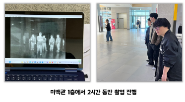
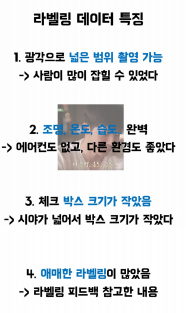
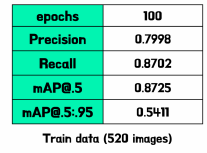
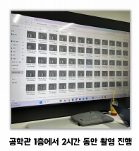
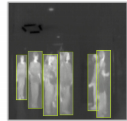
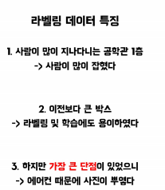
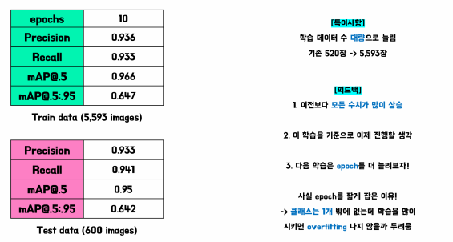
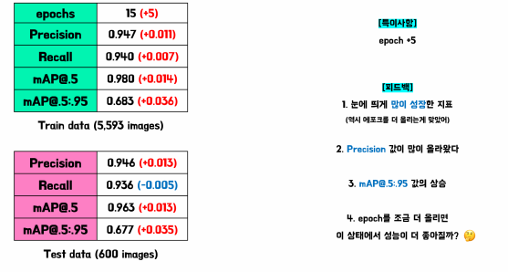
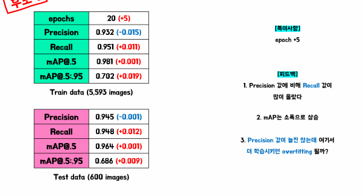

# -FINAL-_TIC_camera_YOLOv7_detection <on-device AI>
    TIC camera TPU person detection using YOLOv7 tiny with Deep_insgiht company.
    Subject: 인공지능과빅데이터 **On-device AI**
    Date: 2024.04.28. ~ 2024.06.21.
    Used: TIC camera with TPU, YOLOv7 object detection model
    Software Environment: Google Cloud Platform, Visual Code
    Co-operate: Deep_insight
---
---
## 0. Title: 인공지능과빅데이터 최종: Team 지능휴먼(IntelliHuman)
#### goal: TIC camera를 이용한 열화상 people detection system 개발.
--------
## 1. R&R 정의
|이름|소속|역할|업무|
|:---:|:---:|:---:|:---:|
|임재영|휴먼지능정보공학전공19|Chief Programmer|프로젝트 리더, 모델 학습 보조|
|김성현|휴먼지능정보공학전공19|Main Programmer|모델 학습 메인, 모델 경량화 연구|
|엄기윤|지능IoT융합전공22|Sub Programmer|학습 데이터 수집, 이미지 라벨링 진행|
|차성욱|지능IoT융합전공22|Sub Programmer|학습데이터 수집, 이미지 라벨링 진행|
|박지현|지능IoT융합전공22|Sub Programmer|문서 정리 담당, 학습 데이터 수집|
---
## 2. 첫번째 촬영, 한 번의 학습
- 촬영 장소: 미래백년관 1층
- 촬영 분량: 2시간 촬영, 필터링 후 약 500장 확보  
 | 
  
  - 데이터 특징  
  
    
  - [학습1]학습 결과  
  
---
## 3. 두번째 촬영, 다섯 번의 학습
- 촬영 장소: 제1공학관 1층
- 촬영 분량: 2시간 촬영, 필터링 후 약 6000여장 데이터 확보  
 | 
  
  - 데이터 특징  
    
  - [학습2]학습 결과  
    
  - [학습3]학습 결과  
    
  - [학습4]학습 결과  
    
